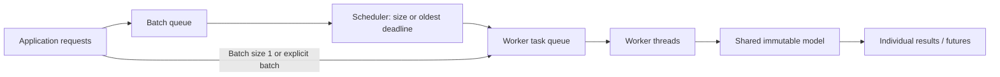
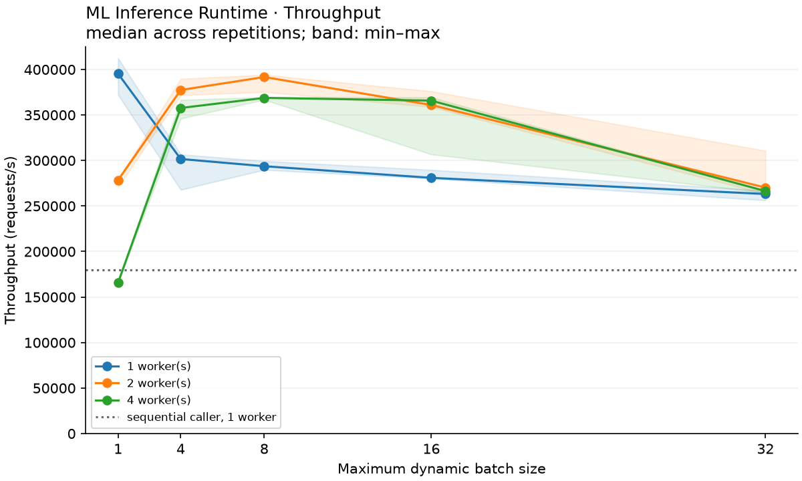

# Multithreaded ML Inference Runtime

A focused **C++17 CPU inference runtime** with a worker pool, futures, dynamic
batching, and reproducible NumPy tooling. It demonstrates how model execution,
request scheduling, ownership, and performance measurement fit together without
depending on a machine-learning framework or downloading a C++ test framework.

The runtime solves a narrow problem: load a small, trained sequential model once,
then serve concurrent predictions while preserving each request's result. It is
an educational systems project, not a replacement for TensorFlow, PyTorch, or ONNX
Runtime. Linux is the CI target; the implementation also builds and runs on macOS.

## Scope

- Contiguous float32 tensors with RAII, checked shapes, debug indexing assertions,
  always-checked multidimensional access, and storage-transferring moves.
- Row-major matrix multiplication, equal-shape addition, vector bias broadcasting,
  ReLU, stable sigmoid, stable row-wise softmax, and per-row argmax.
- Sequential linear/activation models in the documented little-endian
  [MLRTBIN v1 format](docs/model_format.md), with strict shape and file validation.
- Synchronous and future-based individual/batch APIs; immutable shared weights.
- Configurable sleeping workers, a mutex-protected task queue, exception propagation,
  and draining shutdown. No detached threads or thread-per-request execution.
- Dynamic batching by maximum size or oldest-request timeout. Batch size 1 provides
  the unbatched path; explicit batches bypass coalescing.
- A CLI, deterministic NumPy training/export/reference tools, automated tests,
  raw benchmark CSV, and measured throughput/latency/CPU/memory plots.

## Architecture



One scheduler gathers individual inputs; workers execute batches against the same
model. Each inference owns its activations and each caller owns its output. The
FIFO queues have separate mutexes; inference runs outside those locks. Synchronous
calls wait on the same future path. Results may complete out of order, but their
futures and the CLI's output rows retain the original request association.

During shutdown, new submissions are rejected, the scheduler flushes partial
batches, and the worker pool drains and joins. [Architecture and ownership](docs/architecture.md)
explains the locks, deadlines, error paths, memory decisions, and lifetime contract.

## Repository

```text
.
├── CMakeLists.txt
├── README.md, LICENSE, requirements.txt
├── .gitignore, .clang-format, .clang-tidy
├── include/ml_runtime/
│   ├── tensor.hpp
│   ├── model.hpp
│   ├── thread_pool.hpp
│   └── engine.hpp
├── src/                         # corresponding implementations
├── apps/                        # CLI and latency-statistics helper
├── tests/                       # runtime, stress, metrics, and Python tool checks
├── python/
│   ├── model_io.py
│   ├── generate_model.py
│   ├── validate.py
│   ├── benchmark.py
│   └── plot_benchmarks.py
├── models/example_mlp.bin        # small trained example + metadata JSON
├── data/                        # 256 inputs + reference prediction CSV
├── benchmarks/example-run/      # actual local measurements and four plots
├── docs/
│   ├── architecture.md
│   ├── model_format.md
│   ├── benchmark_methodology.md
│   └── verification.md          # executed checks and remaining verification gaps
└── .github/workflows/ci.yml
```

Build directories, the virtual environment, and new `benchmarks/local` runs are
ignored. Only the small example fixtures and one measured example run are intended
for version control.

## Build and test

Prerequisites: a C++17 compiler, CMake 3.20+, a native build tool (`make` or Ninja),
POSIX threads, and Python 3.9+ for tools. Ubuntu's `build-essential`, `cmake`, and
`python3-venv` packages provide the system prerequisites. Python requires only
NumPy and matplotlib; there is no pandas, PyTorch, or psutil dependency.

From the repository root:

```bash
python3 -m venv .venv
source .venv/bin/activate
python -m pip install -r requirements.txt
# If CMake is not already installed (used on the verification machine):
python -m pip install cmake

cmake -S . -B build -DCMAKE_BUILD_TYPE=Release \
  -DPython3_EXECUTABLE="$PWD/.venv/bin/python"
cmake --build build --parallel 4
ctest --test-dir build --output-on-failure

cmake -S . -B build-debug -DCMAKE_BUILD_TYPE=Debug \
  -DPython3_EXECUTABLE="$PWD/.venv/bin/python"
cmake --build build-debug --parallel 4
ctest --test-dir build-debug --output-on-failure
```

The library target is `ml_runtime`; the executable is `ml_inference_cli`. A normal
C++ build needs no Python packages. When NumPy is available at configuration time,
CMake registers `numpy_validation` and `tool_tests` alongside `runtime_tests`,
`concurrency_stress`, and `metrics_tests`. Check the CTest list if running without
the virtual environment. `-DMLRT_REQUIRE_PYTHON_TESTS=ON` makes missing Python/NumPy
a configuration error, as used in CI. No external C++ dependencies are fetched.

The C++ suite covers tensor indexing/shapes/moves, operators, stable activations,
serialization, every truncated prefix of an example model, malformed headers,
versions, dimensions, non-finite weights, unknown layers, single/batched inference,
futures, exceptions, concurrent producers, ordering, size/timeout batching, and
shutdown with queued requests. The Python suite checks ten NumPy/CLI configurations
plus malformed CLI/CSV input rejection.

Repeat the larger concurrency/lifecycle test with:

```bash
ctest --test-dir build -R concurrency_stress --repeat until-fail:10 --output-on-failure
```

## Generate and run the example

The small example is included; this command reproduces its training and fixtures:

```bash
python python/generate_model.py --seed 42 --steps 400 --samples 256
python python/validate.py --cli build/ml_inference_cli \
  --model models/example_mlp.bin --input data/sample_inputs.csv

./build/ml_inference_cli \
  --model models/example_mlp.bin --input data/sample_inputs.csv \
  --threads 4 --batch-size 16 --batch-timeout-ms 2 \
  --output predictions.csv --metrics metrics.json
```

The trained network is **32→64→32→4**, with ReLU hidden layers and softmax output.
Training uses deterministic seeded SGD on a synthetic linear-teacher problem;
`models/example_mlp.json` records the actual settings and accuracy. This is a
runtime correctness example, not a claim of real-world model quality. NumPy
agreement uses `atol=2e-6, rtol=2e-5` and also checks predicted classes.

Actual first three outputs from the included example:

```text
request 0 class=0 scores=0.999995,2.33949e-06,2.17492e-06,1.19769e-08
request 1 class=1 scores=6.93552e-06,0.999981,1.09956e-05,8.87703e-07
request 2 class=2 scores=0.000126948,0.00109795,0.998775,8.82099e-09
```

Use `--requests 3 --warmup 0` to reproduce just these rows. Low-order digits may
vary with compiler/platform. Output CSV has one row per request with no header.
Input CSV must contain finite numbers, no header, and exactly the model's feature
count. Without `--input`, the CLI generates 256 seeded uniform samples. A request
count greater than the file length cycles the rows.
Output paths must differ from model/input paths and from each other; existing
hard links and symlinks are checked too.

```bash
./build/ml_inference_cli --help
# Sequential caller, batching disabled:
./build/ml_inference_cli --model models/example_mlp.bin \
  --mode sync --threads 1 --batch-size 1 --requests 1000 --quiet
```

`--threads` controls inference workers. `--clients` controls the fixed load-generator
client count in concurrent mode (default 32). A single synchronous caller with
batching enabled generally waits for the batch timeout. The CLI exercises dynamic
individual requests; the C++ API additionally accepts explicit batch tensors.

## C++ API

```cpp
#include "ml_runtime/engine.hpp"

int main() {
    using namespace ml_runtime;
    auto model = std::make_shared<const Model>(Model::load("models/example_mlp.bin"));
    InferenceEngine engine(model, {4, 16, std::chrono::microseconds(2000)});

    auto request = engine.predict_async(std::vector<float>(model->input_size(), 0.5f));
    auto synchronous = engine.predict(std::vector<float>(model->input_size(), 0.0f));
    auto batch = engine.predict_batch(Tensor({8, model->input_size()}));
    auto result = request.get();
    engine.shutdown(); // optional: destructor also drains and joins
}
```

Pass tensors/vectors with `std::move` when transferring existing storage. Shape
errors throw before acceptance; execution errors propagate through `future::get`.
Keep the engine alive while other threads use it. Call shutdown from outside the
pool; concurrent shutdown calls are safe. A generic pool task must not wait for
another task in the same exhausted pool.

## Benchmarks

```bash
# Modest default: 5,000 requests per run, 3 repetitions, 1/2/4 workers:
python python/benchmark.py --cli build/ml_inference_cli

# Short validation sweep:
python python/benchmark.py --cli build/ml_inference_cli --requests 512 \
  --warmup 64 --repeats 2 --threads 1 2 4 --batch-sizes 1 8 --clients 16

# Reproduce the configuration of the saved experiment (writes a new local run):
python python/benchmark.py --cli build/ml_inference_cli \
  --threads 1 2 4 --batch-sizes 1 4 8 16 32 --clients 32 \
  --requests 100000 --warmup 2000 --repeats 3 --output benchmarks/local

# Replot existing measurements without running inference again:
python python/plot_benchmarks.py benchmarks/example-run/results.csv \
  --output benchmarks/local/replotted

# Medium compute workload: 267,024 parameters, seeded weights, no training claim.
python python/generate_model.py --widths 256 512 256 16 --steps 0 --samples 64 \
  --model benchmarks/local/medium.bin --data benchmarks/local/medium.csv
python python/validate.py --cli build/ml_inference_cli \
  --model benchmarks/local/medium.bin --input benchmarks/local/medium.csv
python python/benchmark.py --cli build/ml_inference_cli \
  --model benchmarks/local/medium.bin --input benchmarks/local/medium.csv \
  --requests 512 --warmup 64 --repeats 2 --threads 1 2 4 \
  --batch-sizes 1 8 --clients 16 --output benchmarks/local/medium-run
```

Add `--include-hardware` to include the detected logical CPU count when appropriate.
The default avoids saturating a large shared machine. The script saves every
repetition to `results.csv`, build/host/hash metadata to `environment.json`, and
`throughput.png`, `latency.png`, `cpu_time.png`, and `peak_memory.png`.



See the [saved measurement report](benchmarks/example-run/README.md) for actual
numbers and the [methodology](docs/benchmark_methodology.md) for timing boundaries.
Warm-up is excluded. Caller-observed end-to-end latency is separate from summed
model-compute time. CPU time covers all process threads; peak RSS is the process
lifetime high-water mark, including warm-up. The load generator is closed-loop,
so these are not arbitrary-overload latency measurements.

Increasing batch size can amortize scheduling but waits for additional inputs.
Increasing worker count adds concurrency and contention. For this small model,
neither setting guarantees a throughput gain. Results depend on hardware,
workload, compiler, build flags, and background activity; only measured local
observations are reported.

## Sanitizers and developer tools

The audit ran each sanitizer in a separate build. These commands use the locally
verified Apple Clang configuration; ThreadSanitizer must not be combined with ASan:

```bash
cmake -S . -B build-asan -DCMAKE_BUILD_TYPE=Debug \
  -DMLRT_SANITIZER=address -DPython3_EXECUTABLE="$PWD/.venv/bin/python"
cmake --build build-asan --parallel 4
ASAN_OPTIONS=detect_leaks=0:halt_on_error=1 \
  ctest --test-dir build-asan --output-on-failure

cmake -S . -B build-ubsan -DCMAKE_BUILD_TYPE=Debug \
  -DMLRT_SANITIZER=undefined -DPython3_EXECUTABLE="$PWD/.venv/bin/python"
cmake --build build-ubsan --parallel 4
UBSAN_OPTIONS=halt_on_error=1:print_stacktrace=1 \
  ctest --test-dir build-ubsan --output-on-failure

cmake -S . -B build-tsan -DCMAKE_BUILD_TYPE=Debug \
  -DMLRT_SANITIZER=thread -DPython3_EXECUTABLE="$PWD/.venv/bin/python"
cmake --build build-tsan --parallel 4
TSAN_OPTIONS=halt_on_error=1 ctest --test-dir build-tsan --output-on-failure
```

Apple Clang on this macOS ARM64 host rejects `-fsanitize=leak`; its ASan runtime
also rejects `detect_leaks=1`. Local ASan passes therefore **do not verify leaks**.
Linux CI explicitly enables leak detection and first checks that a temporary known
leak is detected. That probe is separate from normal build and CTest targets.

Use LLVM 17 developer tools with the repository's `.clang-format` and `.clang-tidy`.
CMake exposes optional `format-check`, `format`, and `tidy-check` targets when the
corresponding executable is found. Normal builds need neither tool. Checks cover
the project's C++ implementation, CLI, and tests; formatting also covers public and
CLI headers. Build directories and dependencies are excluded. `tidy-check` uses
the actual exported compilation database, and enabled warnings are errors.

```bash
# macOS: the installed formatter was discoverable through xcrun, not PATH.
cmake -S . -B build-debug -DCMAKE_BUILD_TYPE=Debug \
  -DPython3_EXECUTABLE="$PWD/.venv/bin/python" \
  -DMLRT_CLANG_FORMAT="$(xcrun --find clang-format)"
cmake --build build-debug --target format-check
# Apply formatting only when needed, then check again:
cmake --build build-debug --target format
cmake --build build-debug --target format-check

# Linux CI commands after installing clang-17, clang-format-17, clang-tidy-17:
cmake -S . -B build-quality -DCMAKE_BUILD_TYPE=Debug \
  -DCMAKE_CXX_COMPILER=clang++-17 -DCMAKE_EXPORT_COMPILE_COMMANDS=ON \
  -DMLRT_PYTHON_TESTS=OFF -DMLRT_CLANG_FORMAT=clang-format-17 \
  -DMLRT_CLANG_TIDY=clang-tidy-17
cmake --build build-quality --target format-check
cmake --build build-quality --target tidy-check
```

On macOS ARM64, clean Release/Debug tests, separate ASan/UBSan/TSan tests, repeated
concurrency stress, NumPy validation, and Apple clang-format 17 checks passed.
clang-tidy is unavailable locally. Linux execution, Linux formatting/static
analysis, and leak detection remain **pending the first Linux CI run**. The workflow
also installs Python requirements, runs integration tests and repeated stress in
all five build configurations, and smoke-tests benchmarks in Release.
[Verification details](docs/verification.md) record the commands, one corrected
test-harness defect, and the remaining verification gaps.

## Limits and sensible next steps

This version supports dense sequential float32 CPU networks only: no arbitrary
graphs, convolution, GPU, quantization, autograd, framework model import, or
architecture-specific kernels. Model files are capped at 256 MiB. Queues are
unbounded; a service would need admission control. There is no cancellation,
priority scheduling, work stealing, worker affinity, or persistent activation
scratch allocator. Explicit batches can exceed the dynamic batch-size setting.

Timeouts bound batch collection, not total latency. A failing row can fail its
whole dynamic batch. Model saving is not crash-atomic. This project has tests and
sanitizer evidence, not production hardening or a formal concurrency proof.

The next useful work is to run the supplied Linux CI, measure larger models and
longer workloads, then profile before adding BLAS, reusable worker buffers, or
bounded admission. Add an open-loop benchmark when evaluating service-level
latency under overload.

Licensed under the [MIT License](LICENSE).
