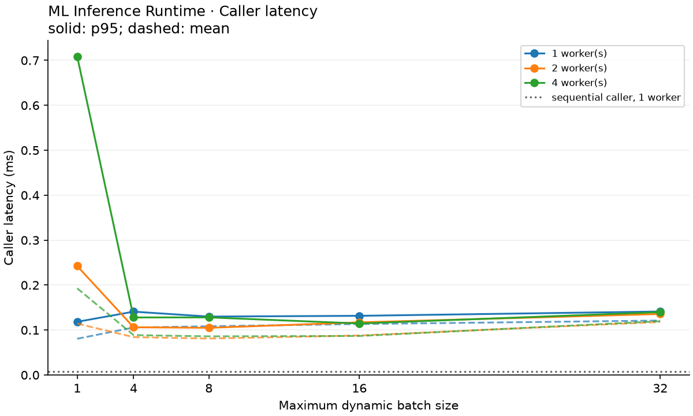
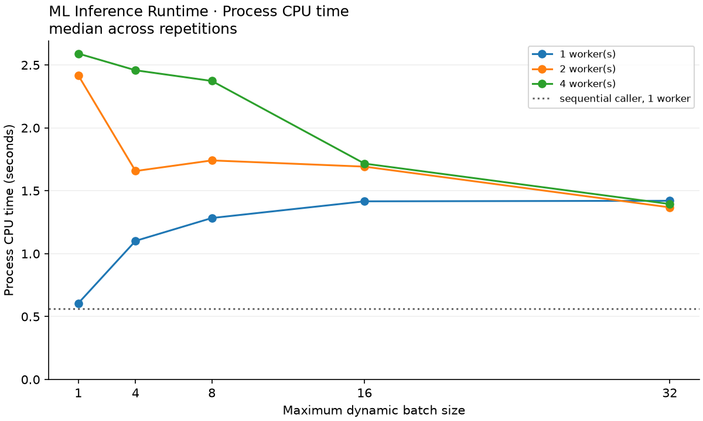
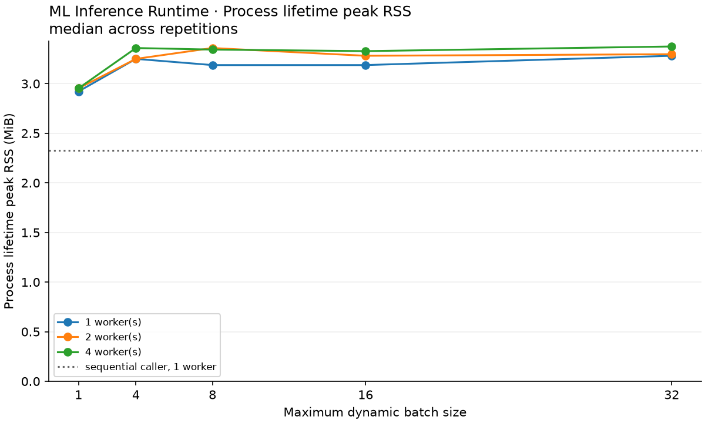

# Measured local example

Historical implementation measurements, retained unchanged. The pre-publication
audit normalized identifying paths in `environment.json` but preserved timestamps,
hashes, and all measured values. Its newer small-workload checks are recorded
separately in [audit-smoke](../audit-smoke/README.md); the full experiment was not rerun.

These are actual measurements from the included executable and model, not expected
or synthesized results. Collected 2026-09-20 06:53 UTC on macOS 15.7.9 ARM64,
12 reported logical CPUs, Apple Clang 17, Release `-O3 -DNDEBUG`. The sandbox did
not permit CPU-brand/RAM queries. See [environment.json](environment.json) for
the exact compiler, settings, timestamps, artifact hashes, and every command.

The 32→64→32→4 model was loaded once per run. Each run completed 2,000 warm-up
requests followed by 100,000 measured requests over the same 256 input rows.
Configurations used 1, 2, or 4 workers and batch maxima 1, 4, 8, 16, or 32 with
32 concurrent clients and a 2 ms timeout. A separate sequential-caller baseline
used one worker, no batching, and one client. Three repetitions of all 16
configurations ran in seed-shuffled order: **48 runs, 4.8 million measured
requests, 16.783 seconds of summed measured wall time**. Most individual runs
remain shorter than a second, so this is an illustrative local experiment.

The following values are medians of the three run-level metrics for each selected
configuration, not metrics from an invented representative run:

- **Sequential caller, 1 worker, batch 1:** 179,810 requests/s; mean latency
  0.00548 ms; median latency 0.00471 ms; p95 0.00775 ms; p99 0.01163 ms;
  measured wall time 0.556 s; process CPU 0.562 s; peak RSS 2.328 MiB.
- **32 clients, 1 worker, batch 1:** 395,429 requests/s; mean latency 0.08061 ms;
  median latency 0.07617 ms; p95 0.11829 ms; p99 0.14242 ms;
  wall time 0.253 s; process CPU 0.606 s; peak RSS 2.922 MiB.
- **32 clients, 2 workers, batch 8:** 391,689 requests/s; mean latency 0.08109 ms;
  median latency 0.07854 ms; p95 0.10492 ms; p99 0.12613 ms;
  wall time 0.255 s; process CPU 1.741 s; peak RSS 3.359 MiB.
- **32 clients, 4 workers, batch 1:** 165,632 requests/s; mean latency 0.19281 ms;
  median latency 0.16113 ms; p95 0.70892 ms; p99 1.09613 ms;
  wall time 0.604 s; process CPU 2.591 s; peak RSS 2.953 MiB.
- **32 clients, 4 workers, batch 16:** 365,781 requests/s; mean latency 0.08679 ms;
  median latency 0.08421 ms; p95 0.11454 ms; p99 0.13929 ms;
  wall time 0.273 s; process CPU 1.716 s; peak RSS 3.328 MiB.

Within the concurrent load, one unbatched worker had the highest median throughput.
Two workers with batches of eight were close, with overlapping observed ranges;
these data do not establish a meaningful universal winner. Four unbatched workers
were substantially slower than one, while batching recovered much of that loss.
At one worker, larger batches reduced measured model compute per request (about
1.154 µs at batch 1 versus 0.605 µs at batch 32), yet overall throughput fell.
This shows why model-compute timing and full request timing must be distinguished.
Scheduling/client overhead is a plausible contributor, not a conclusion proven
by a profiler.

CPU time includes all clients, workers, and the scheduler; it can exceed wall time.
RSS is a whole-process high-water mark, including warm-up, not a tensor-memory
measurement. The sequential baseline uses a different offered concurrency and
must not be used to claim an isolated multithreading speedup. Raw data retains all
48 repetitions, including less favorable results.








Reproduce the configuration from the repository root:

```bash
source .venv/bin/activate
python python/benchmark.py --cli build/ml_inference_cli \
  --threads 1 2 4 --batch-sizes 1 4 8 16 32 --clients 32 \
  --requests 100000 --warmup 2000 --repeats 3 --output benchmarks/local
```

Numbers will vary. Consult the [methodology](../../docs/benchmark_methodology.md)
before drawing conclusions or comparing another implementation.
