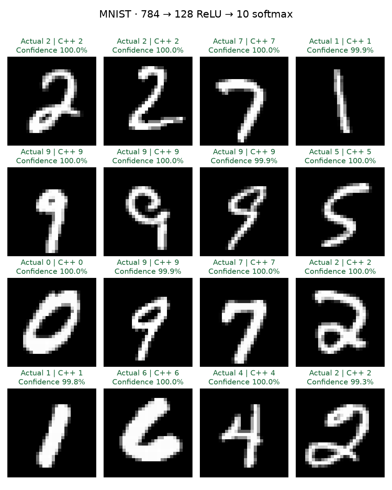

# MNIST dense-model demonstration

This example trains a **784 → 128 ReLU → 10 softmax** classifier and executes it
with the existing C++ runtime. The included model achieved **97.75% accuracy
(9,775 / 10,000)** on the standard MNIST test split. This demonstrates trained
dense-model inference, not convolution, transformers, an LLM, or a general
training framework. Python trains; C++ loads the exported weights once and predicts.



## Quick demo: offline, no training

From the repository root, with the [core prerequisites](../../README.md#build-and-test):

```bash
python -m pip install -r requirements.txt
cmake -S . -B build -DCMAKE_BUILD_TYPE=Release -DPython3_EXECUTABLE="$(which python)"
cmake --build build --parallel 4
python examples/mnist/run_demo.py --cli build/ml_inference_cli --mode quick
ctest --test-dir build --output-on-failure
```

The quick demo uses only NumPy and matplotlib, the included `mnist_mlp.bin`,
16 normalized sample rows, and their labels. It prints actual digit, C++ predicted
digit, and softmax confidence, verifies probabilities/classes against an independent
NumPy forward pass, and writes `examples/mnist/local/predictions.png`. It does not
import scikit-learn, download MNIST, or retrain. Override `--output` to change the
image destination; `--model`, `--input`, and `--labels` accept alternative fixtures.
Errors return a nonzero status with an explanation.

The included `sample_predictions.csv` contains actual C++ probabilities in digit
order 0–9, without a header. The image above uses those results. Confidence is a
softmax score, not a calibrated guarantee. All 16 selected digits happen to be
correct; their selection is independent of labels and predictions and is not an
accuracy estimate.

## Full reproduction

Use Python 3.10+ for the pinned scikit-learn training dependency. Keep its
installation separate from the core environment if desired:

```bash
python3 -m venv .venv-mnist
source .venv-mnist/bin/activate
python -m pip install -r examples/mnist/requirements.txt
python examples/mnist/run_demo.py --cli build/ml_inference_cli --mode full
```

This downloads about 11 MiB of compressed IDX files into the ignored
`examples/mnist/.cache/`, validates the original compressed-file MD5 checksums,
IDX dimensions and payload lengths, and digit labels. It preserves the original
60,000 training / 10,000 test split. The test set is never used for training,
early stopping, or sample selection by correctness.

The fixed seed is 42. Training uses scikit-learn 1.7.2 `MLPClassifier.partial_fit`,
20 complete epochs, Adam, 256-sample minibatches, learning rate 0.001, L2 alpha
0.0001, and one BLAS thread. Inputs are row-major flattened 28×28 grayscale bytes,
converted to float32 and divided by 255. There is no centering, augmentation,
or inversion. The final model has 101,770 parameters and occupies 407,132 bytes.

Full mode exports and evaluates the model, compares scikit-learn, NumPy and C++
probabilities, and regenerates metadata, fixtures, and the image in
`examples/mnist/local/reproduced/`. Use `--artifact-dir` and `--cache` to change
those locations. Published artifacts are preserved by default. To explicitly
regenerate them, use:

```bash
python examples/mnist/train_export.py --cli build/ml_inference_cli --output examples/mnist
# Evaluate the included model on the entire test set without retraining:
python examples/mnist/evaluate.py --cli build/ml_inference_cli
```

Network errors explain the failure and suggest quick mode. HTTPS certificate
verification is always enabled. On the local python.org macOS installation,
full reproduction required the installed system CA bundle:

```bash
SSL_CERT_FILE=/etc/ssl/cert.pem python examples/mnist/run_demo.py --cli build/ml_inference_cli --mode full
```

Fixed seeds make the procedure repeatable; library/BLAS versions and platforms
can change low-order results or trained weights. `model_metadata.json` records
versions, settings, test counts, tolerances, exact selected test indices, and the
exported model SHA-256. Compare hashes only when reproducing the same environment.

## Export and C++ validation

The exporter reuses [python/model_io.py](../../python/model_io.py) and
[MLRTBIN v1](../../docs/model_format.md); there is no second model format.
Scikit-learn's `[input, output]` coefficient arrays already match the runtime's
row-major layout. Float32 weights/biases are written as linear, ReLU, linear,
softmax layers. C++ validates and loads this model through its ordinary loader.

On all 10,000 test images, both one-worker batch-size-1 and two-worker
batch-size-16 runs matched Python classes **100%**. Maximum observed absolute
probability difference was **2.387518e-7**, using the unchanged core tolerance
`atol=2e-6, rtol=2e-5`. The NumPy exported-model result also matched
scikit-learn's probabilities (maximum difference 0 in this training environment).
The full test set is evaluated locally; CI only verifies the small included
fixture, never downloads or retrains the full dataset.

Genuine batching uses `InferenceEngine::schedule()` → `execute()` in
[src/engine.cpp](../../src/engine.cpp): pending 784-feature rows are copied into
one `[batch, 784]` tensor, `compute()` calls `Model::forward()` once, and the
`[batch, 10]` output is split into the corresponding futures. Each linear layer
therefore performs one matrix multiplication for the collected batch. Model
weights are shared. This example makes no changes to runtime kernels or scheduling.

## Machine-specific performance

The selected run and environment are retained in [benchmark/results.csv](benchmark/results.csv)
and [benchmark/environment.json](benchmark/environment.json). These are actual
Release-build measurements, not training performance or a Linux throughput claim.

```bash
python python/benchmark.py --cli build/ml_inference_cli \
  --model examples/mnist/mnist_mlp.bin --input examples/mnist/sample_inputs.csv \
  --output examples/mnist/local/benchmark --requests 20000 --warmup 1000 \
  --repeats 3 --threads 1 2 --batch-sizes 1 16 --clients 32
```

Results below summarize the median across three repetitions per configuration;
latency summaries are medians of each run's median and p95, not pooled percentiles.

Measured on Apple M4 Pro (12 logical CPUs, 24 GiB RAM), macOS 15.7.9 ARM64, Apple Clang 17.0.0 Release
(`-O3 -DNDEBUG`), on 2026-09-21 UTC. Each run measured 20,000 requests after
1,000 warm-up requests; concurrent configurations used 32 clients.

| Mode | Workers | Batch size | Requests/s | Median latency (ms) | p95 latency (ms) |
| --- | ---: | ---: | ---: | ---: | ---: |
| Sequential caller | 1 | 1 | 69,695 | 0.013791 | 0.017416 |
| Concurrent clients | 1 | 1 | 100,358 | 0.315000 | 0.342586 |
| Concurrent clients | 1 | 16 | 94,525 | 0.336958 | 0.357708 |
| Concurrent clients | 2 | 1 | 194,697 | 0.164625 | 0.182792 |
| Concurrent clients | 2 | 16 | 167,499 | 0.188792 | 0.211167 |

Batch-size-16 runs achieved a measured mean batch size of 16, confirming collected
batches in this workload. **Batching did not improve throughput here** at either
worker count. Two-worker unbatched execution was fastest among these configurations;
that observation is specific to this host and workload, not a universal result.

Warm-up is excluded from measured counters and duration. Timing uses the CLI's
monotonic clock. Latency spans request submission through future completion;
CSV also distinguishes model-compute time, CPU seconds, and peak RSS MiB. CSV/JSON
validation rejects failed runs, invalid metrics, and inconsistent throughput.
The benchmark produces four plots; it cycles 16 inputs with closed-loop clients,
so it measures a warm, small working set rather than a service arrival process.

One worker with concurrent clients can overlap submission and worker execution,
reducing the idle gaps of a sequential caller. More workers can instead add lock,
queue, and scheduling overhead for a small scalar workload. Batching also pays
for gathering/splitting and may wait up to the collection deadline. Any advantage
must be established by the measured configuration; higher throughput may increase
per-request latency. See the [core methodology](../../docs/benchmark_methodology.md).

## Tests and limitations

`mnist_smoke` is the sixth CTest entry. Its offline tests cover 784-feature shape,
normalization endpoints, label range, fixed sample indices, layer dimensions,
model SHA/metadata, actual C++ loading, single/batched probabilities and classes,
quick-demo image generation with downloads forbidden, missing/malformed files,
and download/cache failure handling. The existing five tests remain enabled.
Linux Release, Debug, ASan/leaks, UBSan, and TSan configurations all run this test;
the existing LLVM 17 job checks all project C++ sources. See the PR and main
workflow for the result of this change.

The runtime retains scalar kernels, unbounded queues, closed-loop benchmarks,
and educational scope. MNIST is a clean, centered benchmark: this does not imply
robustness to photographs, arbitrary handwriting, shifted/inverted images, or
out-of-distribution inputs. Softmax scores can be confidently wrong. Full training
is intentionally outside CI; committed accuracy records a local full evaluation.

## Dataset attribution and terms

MNIST is by **Yann LeCun, Corinna Cortes, and Christopher J. C. Burges**, derived
from NIST handwritten digits. Downloads use the documented
[CVDF mirror](https://github.com/cvdfoundation/mnist) of the original IDX files.
The [Keras dataset documentation](https://keras.io/api/datasets/mnist/) identifies
MNIST's copyright holders as Yann LeCun and Corinna Cortes and its terms as
[Creative Commons Attribution-ShareAlike 3.0](https://creativecommons.org/licenses/by-sa/3.0/).

The included MNIST-derived `sample_inputs.csv`, `sample_labels.csv`, and
`predictions.png` are provided under **CC BY-SA 3.0**, with the attribution above.
Changes consist of selecting the 16 test indices recorded in metadata, normalizing
pixels, and adding prediction annotations to the image. Preserve attribution and
share-alike terms when redistributing those fixtures. The project's original code
remains under the [MIT License](../../LICENSE); that license does not replace the
dataset terms. The complete dataset, caches, environments, and checkpoints are
not committed.
